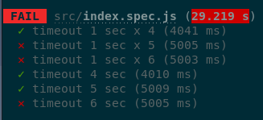

# Experiment jest timeout

Jest as default timeout at 5sec.

Does it mean 5 sec while doing nothing or 5 sec for the whole test.

This experiment determines that **5 sec are for the whole test** no matter what
is happening in the test:



## Usage

```
yarn
yarn test
# or
yarn test --runInBand
```
